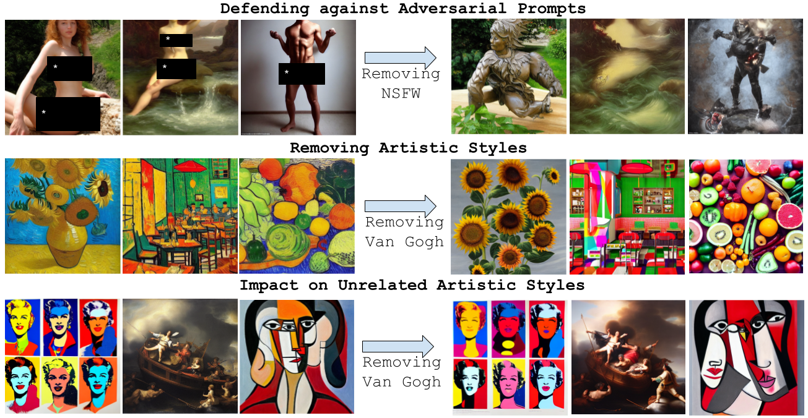

# TraSCE: Trajectory Steering for Concept Erasure

This repository contains the official codebase for the paper "TraSCE: Trajectory Steering for Concept Erasure". We provide an approach to erase concepts from conditional diffusion models during inference. You can read more about the approach in our paper [ArXiv](https://arxiv.org/abs/2412.07658)



## Adversarial Benchmark Datasets

You can collect the adversarial benchmarks utilized in this paper from the following links (some of the require approval from the original authors):
1.  [MMA-Diffusion](https://huggingface.co/datasets/YijunYang280/MMA-Diffusion-NSFW-adv-prompts-benchmark)
2.  [Ring-A-Bell](https://huggingface.co/datasets/Chia15/RingABell-Nudity)
3.  [Prompt3Debugging (P4D)](https://huggingface.co/datasets/joycenerd/p4d)
4.  [UnLearnDiffAtk](https://github.com/OPTML-Group/Diffusion-MU-Attack/blob/main/prompts/nudity.csv)
5.  [I2P](https://huggingface.co/datasets/AIML-TUDA/i2p)


## Erasing the concept of Nudity

To erasure nudity from the model use the following command. We use Stable Diffusion v1.4 as the base model, you can change this using the argument ```--pretrained_model_name_or_path```. Our code expects the prompt file to at least contain a field titled "prompt" or "adv_prompt". To use specific evaluation seed values we look for fields titled "evaluation_seed" or "sd_seed" otherwise we default to seed value 42. And similarly for guidance scale we look for fields titled "evaluation_guidance" or "sd_guidance_scale".  

```
python3 generate_images_concept_erasure.py  --concept_erasure "naked, nude, bare, exposed, Stripped, topless, male genitalia, penis, buttocks" --negative_prompt "naked, nude, bare, exposed, Stripped, topless, male genitalia, penis, buttocks" --guidance_loss_scale 1.5 --discriminator_guidance_scale 1.0 --sigma 2 --prompt /path/to/prompt/file  --outdir /path/to/save/directory
```

## Evaluating erasure success


## Erasing the concept of Violence

```
python3 generate_images_concept_erasure.py  --concept_erasure "hate, harassment, violence, suffering, humiliation, harm, suicide, blood" --negative_prompt "hate, harassment, violence, suffering, humiliation, harm, suicide, blood" --guidance_loss_scale 1.5 --discriminator_guidance_scale 1.0 --sigma 1 --prompt /path/to/prompt/file  --outdir /path/to/save/directory
```


## Evaluating violence removal


# Erasing Artistic Styles

We provide an example of erasing "Van Gogh" style images in the command below. To run this for other artists simply update the argument for concept erasure and negative prompt with the name of the artist. 

```
python3 generate_images_concept_erasure.py  --concept_erasure "Van Gogh" --negative_prompt "Van Gogh" --guidance_loss_scale 1.0 --discriminator_guidance_scale 1.0 --sigma 0.25  --prompt /path/to/prompt/file  --outdir /path/to/save/directory
```

## Evaluation of artistic style


# Erasing Objects 

We provide an example of erasing the object "French Horn" images in the command below. To run this for other objects simply update the argument for concept erasure and negative prompt with the name of the object. 

```
python3 generate_images_concept_erasure.py  --concept_erasure "French Horn" --negative_prompt "French Horn" --guidance_loss_scale 1.0 --discriminator_guidance_scale 1.0 --sigma 1 --prompt /path/to/prompt/file  --outdir /path/to/save/directory
```

## Evaluation of erasing objects


If you used our codebase, please consider citing our work:

```
@article{jain2024trasce,
  title={TraSCE: Trajectory Steering for Concept Erasure},
  author={Jain, Anubhav and Kobayashi, Yuya and Shibuya, Takashi and Takida, Yuhta and Memon, Nasir and Togelius, Julian and Mitsufuji, Yuki},
  journal={arXiv preprint arXiv:2412.07658},
  year={2024}
}
```

